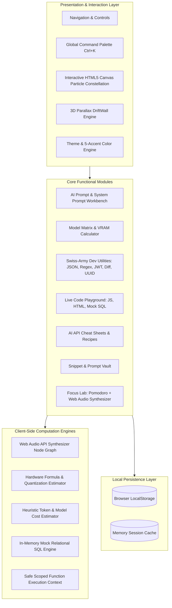
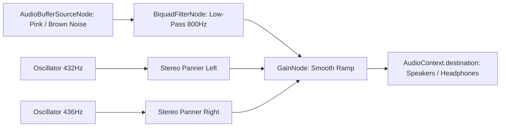

# 🏗️ DevForge AI — System Architecture & Technical Design

This document details the software architecture, data flow, client-side subsystems, and security model of **DevForge AI**.

---

## 🏛️ High-Level Architecture Overview

DevForge AI is engineered as an **offline-first, zero-dependency Single Page Application (SPA)**. It relies strictly on standard web platform primitives (HTML5, Vanilla CSS3 with Custom Properties, and ES6+ JavaScript) without bundling overhead or third-party runtime frameworks.



---

## 🧩 Subsystem Deep Dives

### 1. 🎧 Web Audio API Soundscape Engine
The Focus Lab features real-time audio synthesis powered entirely by the browser's `AudioContext`. It does **not** load external MP3/WAV files, ensuring zero bandwidth consumption and infinite playback loops without seamless looping seams.

* **Noise Generation Architecture**:
  * An `AudioBuffer` is allocated (typically 5 seconds at sample rate 44,100Hz).
  * **White Noise**: Random float generation `(Math.random() * 2 - 1)`.
  * **Pink Noise**: Paul Kellet's 3-pole filter approximation applied to Gaussian white noise.
  * **Brown Noise**: Integrated white noise with a leak coefficient `lastOut = (lastOut + (0.02 * white)) / 1.02`.
  * The buffer is passed to an `AudioBufferSourceNode` with `loop = true`, piped into a `BiquadFilterNode` for low-pass warm resonance, and finally routed to a `GainNode` for linear volume ramping.
* **Binaural 432Hz Drone**:
  * Dual `OscillatorNode` instances generating pure sine waves: 432Hz carrier in Left channel, 436Hz in Right channel via a `ChannelMergerNode`.
  * Produces a calming 4Hz theta-wave binaural beat in the listener's brain when using headphones.



---

### 2. 🌌 HTML5 Canvas Particle Constellation Engine
Rendered directly on `#bg-canvas` behind all UI elements:
* Dynamic sizing via `window.innerWidth` and `window.innerHeight`.
* Responsive particle density scaling: `count = Math.min(Math.floor(window.innerWidth / 20), 65)`.
* Particle physics: Position update with velocity vectors `(vx, vy)` and wrapping boundaries.
* Proximity calculation: Distance Euclidean metric `dist = Math.sqrt(dx*dx + dy*dy)`.
* Dynamic alpha line rendering for distances `< 110px` utilizing accent color tokens.
* Loop executed via `requestAnimationFrame(renderCanvas)` with zero memory leaks.

---

### 3. 🧮 Hardware VRAM Estimation Mathematics
The Model Matrix and Hero Quick Calc employ empirical hardware formulas calibrated against real LLM deployment benchmarks:

$$\text{Weights VRAM (GB)} = \text{Parameters (B)} \times \left(\frac{\text{Quantization Bits}}{8}\right) \times 1.15$$

$$\text{KV Cache VRAM (GB)} = 2 \times \text{Layers} \times \text{Heads} \times \text{HeadDim} \times \text{Context Length} \times \text{BytesPerElement}$$

* **Safety Overhead Factor ($1.15$)**: Accounts for CUDA/ROCm memory fragmentation, PyTorch/GGML runtime context, and activation memory.
* **Context Overhead**: A 4,096 context window baseline adds $\sim 1.0\text{ GB}$ to $1.2\text{ GB}$.

---

### 4. 🗄️ In-Memory Mock SQL Engine
The Code Playground contains a self-contained SQL interpreter:
* Parses statements matching `SELECT ... FROM <table> [WHERE ...] [ORDER BY ...]`.
* Supported tables: `developers`, `ai_models`.
* Returns dynamically formatted HTML table elements with instant feedback and toast alerts.

---

### 5. 🛡️ Isolated JavaScript Execution Sandbox
* Employs scoped execution via `new Function('console', code)`.
* Injects a sandboxed proxy `customConsole` containing `.log()`, `.warn()`, `.error()`, and `.table()`.
* Captures all outputs into an array, serializing complex objects with `JSON.stringify(..., null, 2)` without polluting global developer devtools.

---

## 💾 LocalStorage Data Schema

All persistent state is stored under namespaced keys:

| Key | Type | Description |
| :--- | :--- | :--- |
| `devforge_theme` | `string` (`"dark"` \| `"light"`) | Active global color mode |
| `devforge_accent` | `string` (`"cyan"` \| `"purple"` \| `"emerald"` \| `"flame"` \| `"amber"`) | Selected accent palette |
| `devforge_users` | `Array<UserObject>` | Registered local developer accounts |
| `devforge_session` | `UserObject` \| `null` | Currently authenticated user |
| `devforge_snippets` | `Array<SnippetObject>` | User-saved code snippets and prompts |
| `devforge_tasks` | `Array<TaskObject>` | Focus Lab daily task scratchpad list |

### Sample Schema Objects:

```json
// SnippetObject
{
  "id": "snip-1725000000000",
  "title": "Resilient Retry with Exponential Backoff",
  "tag": "typescript",
  "code": "async function retry<T>(fn: () => Promise<T>, attempts = 3): Promise<T> { ... }"
}

// TaskObject
{
  "id": "task-1725000000000",
  "text": "Optimize VRAM allocations for Llama 3.3 70B",
  "completed": false
}
```

---

## 🔒 Security Model & Best Practices

1. **Client-Side Only**: No API keys, JWT tokens, source code, or personal data ever leave the client browser.
2. **XSS Protection**: User input rendered in the HTML Sandbox is sandboxed within an iframe `srcdoc` with restricted access permissions.
3. **No External CDN Dependencies for Logic**: Core application logic, mathematical calculations, and sound synthesis are 100% bundled in `script.js`.
